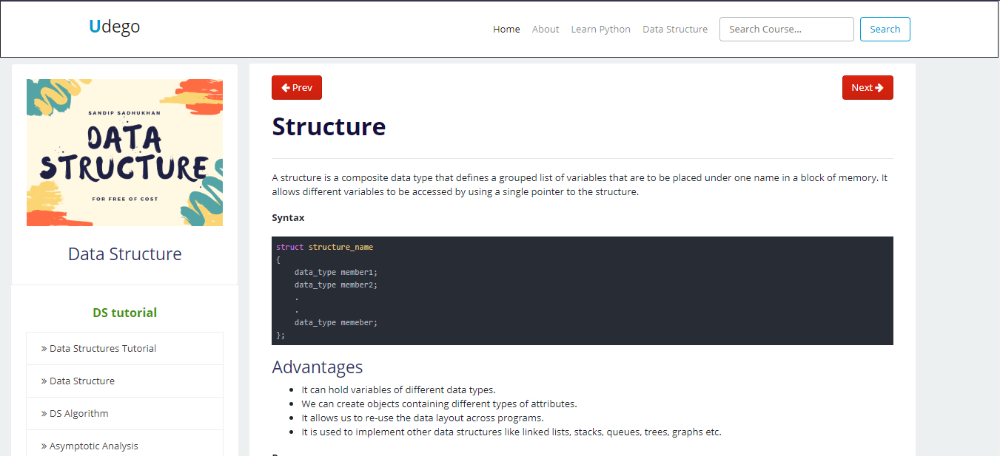
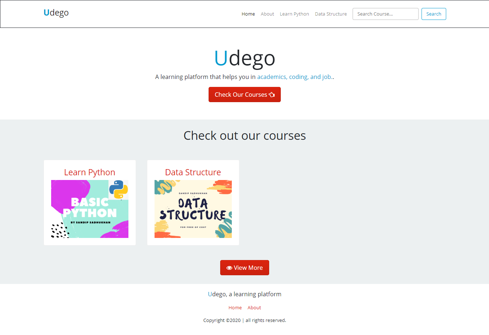

# Udego
A learning platform that helps you in academics, coding, and job
Live Link - https://sandipsadhukhan.pythonanywhere.com/

## What is do
It is a article based course website primarily focused on academics, coding type tutorial blogs.

---
You Have a seprate admin panel to manage all your course and subcourse.


## Screenshots
Course Page



Home Page



## Technology Used
- HTML
- CSS
- Bootstrap
- Javascript
- Django
- Sqlite
- PythonAnywhere (for deploy)

## How to run locally
- Requirement: Python 3, Pip
```bash
# clone the repo
https://github.com/sandippakhanna/udego.git

# install all dependencies
cd udego
pip install -r requirements.txt

# migrate the database
python manage.py migrate

# run the app
python manage.py runserver
```
Open http://localhost:8000 in your browser

## Developer
Sandip Sadhukhan

Mail - sandip.sendme@gmail.com
